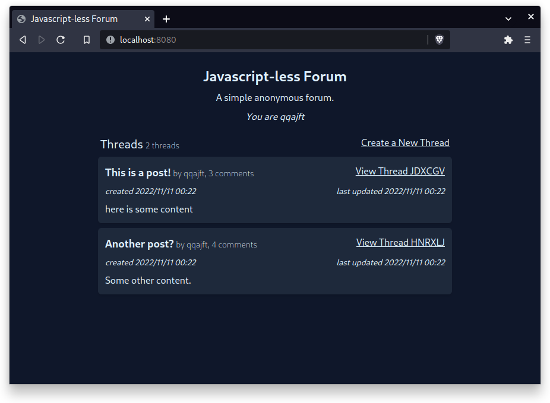

# nojs-forum

❌ NO JAVASCRIPT ❌

A simple online forum, completely server side rendered. Rust actix-web/sqlite backend and "pure" html/css frontend.



requirements:
 - tailwindcss cli (from npx)
 - rust

building:
```shell
$ make
```

development:
```
$ cargo watch -s "make run"
```
